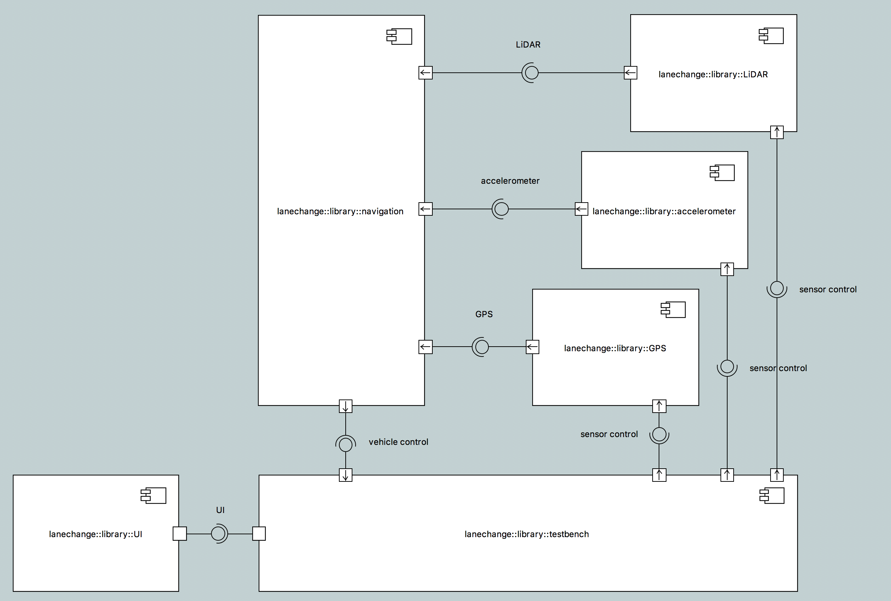

---

This work is licensed under the Creative Commons CC0 License

---

# Model-based Turbulence Testing
### xtUML Project Analysis Note

### 1. Abstract
A customer has requested that a model-based testing platform for self-driving
cars be prototyped. The goals of the project or to demonstrate the capabilities
of xtUML and model-based testing, and to affirm the role of modeling in
testing.

### 2. Document References
2.1 [#9339 Model-Based Turbulence Testing](https://support.onefact.net/issues/9339) Issue to track this work  
2.2 [#9405 build model of turbulence testing](https://support.onefact.net/issues/9405) Issue to build a model for turbulence testing  
2.3 [Qt](https://www.qt.io/) Cross-platform UI framework  

### 3. Background
A model shall be built that demonstrates testing a model of a self-driving car
changing lanes. The central goal of this model shall be to test the resilience
of a navigation module to turbulence in sensor data. Testing shall be automated
such that recorded sensor data can be played back and noise can be inserted at
different levels. This will allow the correctness of the navigation module's
responses in a consistent and reproducible manner.

### 4. Requirements
4.1 A model shall be built to represent a lane change test scenario  
4.1.1 The model shall include one or more simulated sensors  
4.1.2 The model shall include a navigation module  
4.1.3 The model shall include a test platform which can control test parameters  
4.1.4 The simulated sensors shall have the ability to play back recorded data
and insert noise  
4.2 A graphical user interface shall be provided to interface with the model  
4.3 A test plan with several scenarios shall be provided to fully exercise and
demonstrate the system  
4.4 The model shall be built to abstract away complexity and present simplicity  

### 5. Analysis

5.1 Existing work

A lane change model has already been prototyped. This model is not complete, but
was used to explore the domain space. See the following system diagram:

The model has been implemented to read data for a LiDAR sensor from a file and
send signals to the navigation module on a predetermined interval. No
implementation for turbulence has been provided.

5.2 Turbulence

Turbulence must be inserted into the data. There are a few ways to do this. A
model could be created to modify the data as it is read from the file in the
sensor components. This model could take specific parameters for the type of
noise and how much to introduce. Alternatively, a mechanism could be introduced
to inject noise as the messages pass across the interface itself. This has not
been done before in xtUML and presents an opportunity to explore a new area of
modeling.

5.3 UI

Qt [[2.3]](#2.3) has been used in a previous project to quickly develop a
workable graphical interface. It will be explored again for use with this
project to provide aesthetically pleasing and responsive output to the running
model.

### 6. Work Required

6.1 Finish building the lane change model  
6.2 Implement turbulence injection  
6.3 Determine the test plan  
6.4 Build the UI  
6.5 Polish the demonstration  

### 7. Acceptance Test

End
---

