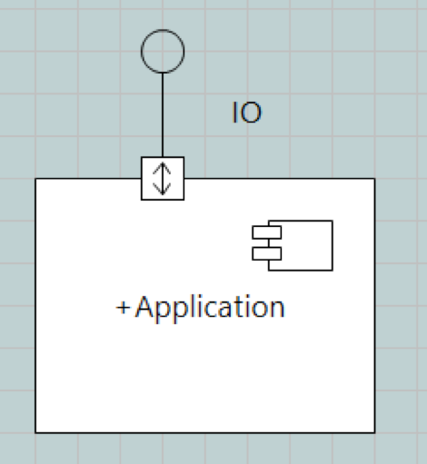
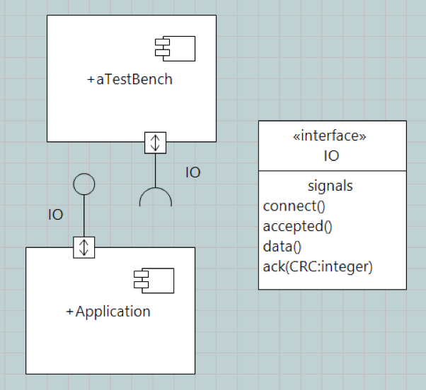
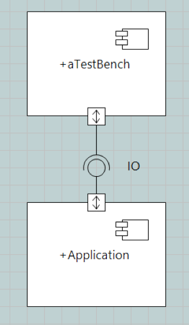
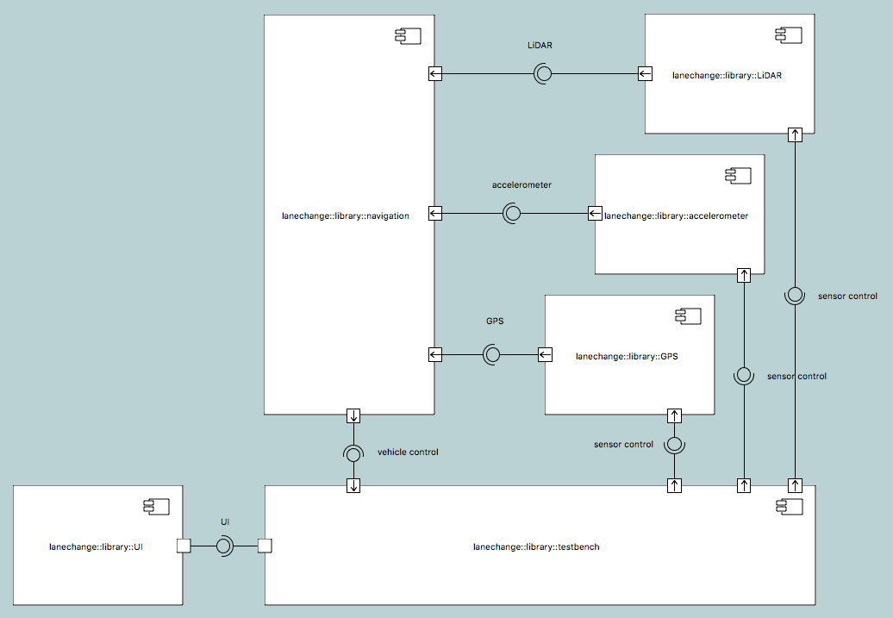
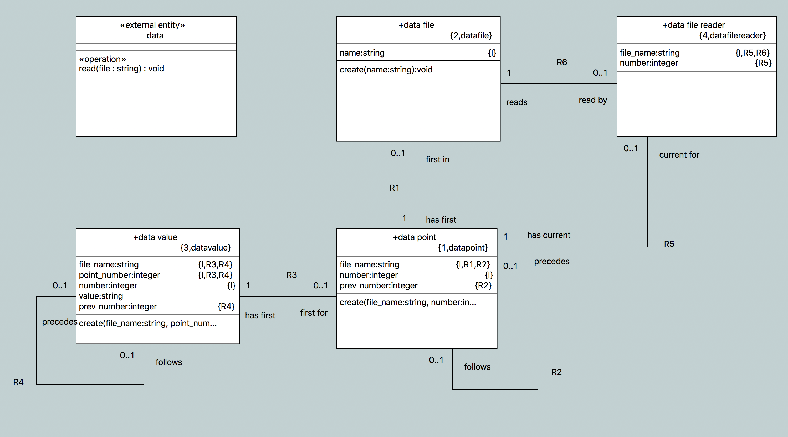

# Model-Based Testing for Self-Driving Cars Navigation

## Self-Driving Car Testing

Self-driving cars pose challenges to testing.  The quantity and
magnitude of sensor inputs create an enormous test vector space.
Traditional manual testing methods are inadequate to cover this
multi-dimensional vector space with test cases.
To address this challenge model-based techniques are applied to manage the testing complexity.
Abstraction and automation increase the productivity of the test engineering.
Model-based test engineering allows generation of test cases, test data and predicted behavior.
Sensor test generation, automated Navigation testing and turbulence induced testing are elements of a strategy to improve the efficiency of testing for self-driving cars.
A case study is provided as an example.
Conclusions are then summarized.

### Sensor Test Generation

Self-driving cars employ many sensors as input to the Navigation.
Global positioning (GPS), enhanced GPS, LiDAR, accelerometers and cameras are just a few of the sensors used in Navigation.
A model-based engineering approach abstracts the sensors with models.
By modeling the sensors, automated test vector generation is enabled.
A component represents functionality exposed through explicit interfaces.
Thus, the internal behavior of the component can be
abstracted and modeled using a variety of techniques including C coding,
Ruby scripting, Executable UML modeling or other methods of encoding behavior.

The interface to a sensor component provides a simple way of providing
input data to the application Navigation component.
The modeled interface between the Navigation application and the
sensor components enables injection of file-based test input data.
A standardized method of reading pre-recorded or pre-calculated sensor data
has been modeled and is part of the test bench modeling configuration.
Carefully pre-calculated and simulated sensor data is important for exploring the requirements of sensors.
Data recorded during actual drives is useful to stimulate the Navigation application in the laboratory environment.
Recording sensor input is an efficient means of gathering a portion of the data required for automated testing of the self-driving car.

### Test Generation for the Navigation Application

When an application is modeled at an abstract level, its behavior is captured in a model that can be executed and tested.
This model predicts correct behavior based on correct input.
The same model can be used to detect and grade incorrect input.
Since the model does not physically crash like a vehicle in the real world, it can be used to explore erroneous and noisy data and used to develop recovery from bad sensor input.

The same model can be manipulated to _generate_ its own input.
Given a route, a Navigation application can automatically produce the sensor input that would cause the self-driving car to follow the route.
This capability can be used to automatically produce the massive quantity of test vector data needed to exercise the production system.

### Automatic Generation of Turbulence

The above elements can now be combined to produce test cases and test data that contain measured amounts of turbulence (noise).
With simple, abstract models of sensors and the application under test, we can automate the generation of tests including prescribed levels of noise.
The ability to introduce turbulence into one or more sensors allows exploration of test scenarios involving faulty or noisy data coming from a combination of sensors.
The test cases and test data are used to test the Navigation application in a simulation environment first and then in production.

### Case Study

#### Case Study Document References

2.1 [#9339 Model-Based Turbulence Testing](https://support.onefact.net/issues/9339)  
2.2 [#9405 build model of turbulence testing](https://support.onefact.net/issues/9405)  
2.3 [Valhalla](https://github.com/valhalla/valhalla)  
2.4 [OpenStreetMap](https://www.openstreetmap.org/about)  
2.5 [Mapzen](https://mapzen.com/)  
2.6 [polyline algorithm](https://developers.google.com/maps/documentation/utilities/polylinealgorithm)  
2.7 [turbulence model demo](https://www.youtube.com/watch?v=GeR_t-eA2JU)  
2.8 [turbulence model](https://github.com/xtuml/models/tree/master/applications/lanechange)  

#### Case Study Requirements

A model shall be built that demonstrates model-based testing in the context of self-driving cars.  
  - The model shall be fed input GPS data.  
  - The model shall have a navigation module that interprets GPS data and outputs verbal instructions.  
  - The design of the model shall consider a mechanism for injecting turbulence into the input GPS data.  

#### Test Benching Concept

'Test Benching' is the concept of substituting a testbench component in place of a compatible functional component.
A component requires and interface.
Another component with the same interface is considered compatible.
Therefore, a test bench component can be substituted for any component in a system as long is it has compatible interfaces.

Here is an example application component.

Here is an example test bench component.

Here is the example test bench with its corresponding application component and interface.

Now we wire them together to run the test.

#### Model

##### System

The system model is made up of a testbench component, a Navigation component,
and three sensor components.  This model focuses on the GPS sensor component.

##### Testbench

The testbench initiates the simulation.  For each sensor, the testbench
component passes a data file of simulated data and starts a global tick
that moderates the frequency at which data points are consumed by the
sensors.  In the current case study the GPS component is the only
component which is initialized and passed a data file.

##### Sensors

Internally, each sensor has a state machine to manage delivering sensor events
on a tick (provided globally by the testbench). After each tick, the next data
point is read and passed to the navigation module via an interface signal.

##### Test data

A model of data is provided to allow the sensors to read data from a file. An
external entity written in native C parses and populates the model. Once the
model is populated, the reader class can supply the next data point on demand.

##### Navigation

The navigation module receives GPS location events and
populates a map route. To produce verbal instructions from the GPS coordinates
(i.e. to detect when a turn is made and notify the user), knowledge of map data
and complex mapping algorithms are needed. Because this is the module that must
be tested and this model focuses on testing, no attempt was made to implement a
solution from scratch.

Valhalla [[2.3]](#2.3) is an open source project dedicated to complex mapping
operations using data from OpenStreetMap [[2.4]](#2.4). Mapzen [[2.5]](#2.5) is
an open platform for mapping applications which provides web APIs for many
mapping operations and uses Valhalla behind the scenes. The Mapzen API was
chosen to implement the navigation module.

For navigation _map matching_ needs to be applied to the GPS route produced from
the GPS events. Map matching attempts to overlay a route of real GPS points over
a map with some tolerance for imprecise GPS data. We can then use this
theoretical route from the map to harvest verbal instructions when a turn is
made. To invoke this map matching, Mapzen requires a GPS route be encoded as a
polyline [[2.6]](#2.6), which is an algorithm developed by Google to encode many
GPS lat/lon pairs into a readable ASCII string. An external entity is provided,
written in native C, to encode the modeled map route into a polyline. Another
external entity is provided to call the Mapzen web API and return the most
recent instruction (if changed). The navigation module prints this instruction.

#### Case Study Demo

See a demo of the application linked in [[2.7]](#2.7). This shows the
application running with data from the following GPS path.

##### Turbulence

Because manufactured GPS data is being used, a consistent method of injecting
noise into the data is required.  A mechanism can be implemented in the GPS
sensor component itself to disturb the data in a measured way.
Alternatively, a mechanism can be implemented outside the scope of this model
in the utility that collects or produces the GPS data.  The collected/calculated
data can have differing amounts of turbulence added to each location point.
