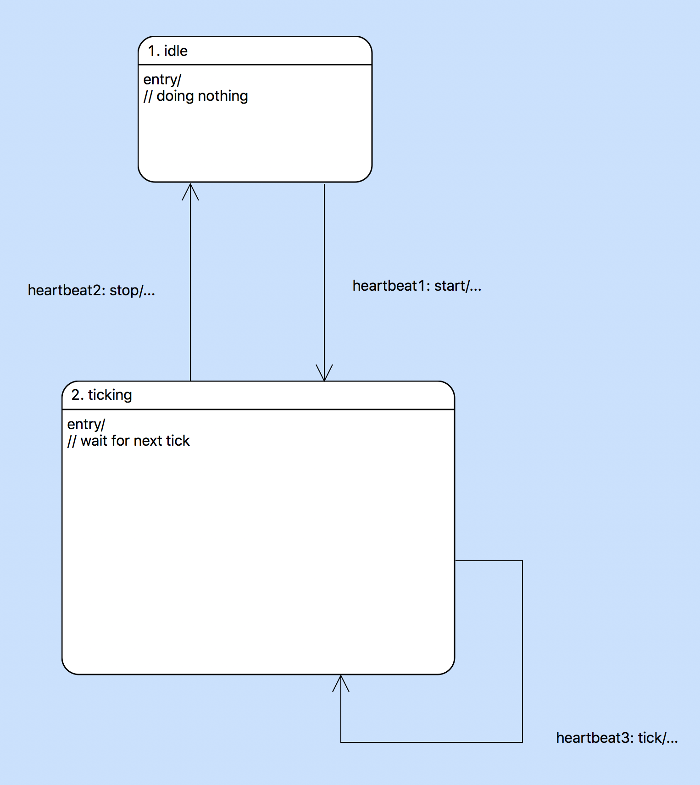
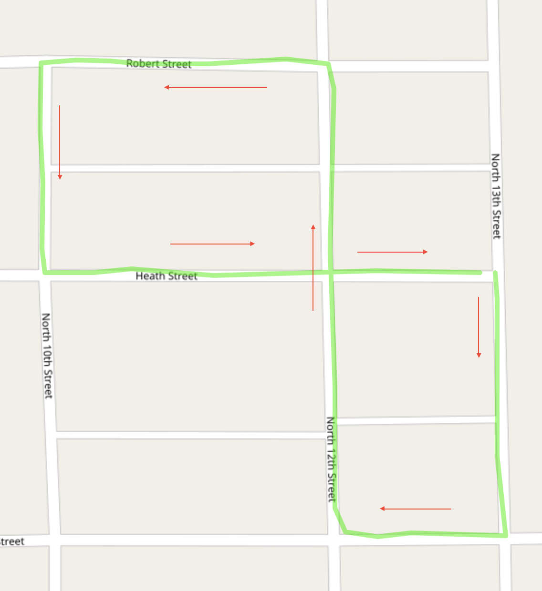

---

This work is licensed under the Creative Commons CC0 License

---

# Model based turbulence testing
### xtUML Project Analysis Note

### 1. Abstract

This note calls out the technical work that has been done with the model of
turbulence testing in self driving cars

### 2. Document References

2.1 [#9339 Model-Based Turbulence Testing](https://support.onefact.net/issues/9339)  
2.2 [#9405 build model of turbulence testing](https://support.onefact.net/issues/9405)  
2.3 [Valhalla](https://github.com/valhalla/valhalla)  
2.4 [OpenStreetMap](https://www.openstreetmap.org/about)  
2.5 [Mapzen](https://mapzen.com/)  
2.6 [polyline algorithm](https://developers.google.com/maps/documentation/utilities/polylinealgorithm)  
2.7 [turbulence model demo](https://www.youtube.com/watch?v=GeR_t-eA2JU)  
2.8 [turbulence model](https://github.com/xtuml/models/tree/master/applications/lanechange)  

### 3. Background

None

### 4. Requirements

4.1 A model shall be built that demonstrates model based testing in the context
of self driving cars  
4.1.1 The model shall be fed input GPS data  
4.1.2 The model shall have a navigation module that interprets GPS data and
outputs verbal instructions  
4.1.3 The design of the model shall consider a mechanism for injecting
turbulence into the input GPS data  
4.2 A paper shall be produced to capture the details of the model in the context
of model based testing  
4.3 A presentation shall be produced to demonstrate the model and the testing
method  

### 5. Analysis

5.1 Modeling

5.1.1 System

The system model is made up of a testbench component, a navigation component,
and three sensor components. This model focuses on the GPS sensor component.

5.1.2 Testbench

The testbench initiates the simulation. For each sensor, the testbench component
passes a data file of simulated data and starts a global tick that moderates the
frequency at which data points are consumed by the sensors. Currently the GPS
component is the only component which is initialized and passed a data file.

5.1.3 Sensors

Internally, each sensor has a state machine to manage delivering sensor events
on a tick (provided globally by the testbench). After each tick, the next data
point is read and passed to the navigation module via an interface signal.

5.1.3.1 Test data

A model of data is provided to allow the sensors to read data from a file. An
external entity written in native C parses and populates the model. Once the
model is populated, the reader class can supply the next data point on demand.

5.1.4 Navigation

The navigation module receives GPS module receives GPS location events and
populates a map route. To produce verbal instructions from the GPS coordinates
(i.e. to detect when a turn is made and notify the user), knowledge of map data
and complex mapping algorithms are needed. Because this is the module that must
be tested and this model focuses on testing, no attempt was made to implement a
solution from scratch.

Valhalla [[2.3]](#2.3) is an open source project dedicated to complex mapping
operations using data from OpenStreetMap [[2.4]](#2.4). Mapzen [[2.5]](#2.5) is
an open platform for mapping applications which provides web APIs for many
mapping operations and uses Valhalla behind the scenes. The Mapzen API was
chosen to implement the navigation module.

For navigation map matching needs to be applied to the GPS route produced from
the GPS events. Map matching attempts to overlay a route of real GPS points over
a map with some tolerance for imprecise GPS data. We can then use this
theoretical route from the map to harvest verbal instructions when a turn is
made. To invoke this map matching, Mapzen requires a GPS route be encoded as a
polyline [[2.6]](#2.6), which is an algorithm developed by Google to encode many
GPS lat/lon pairs into a readable ASCII string. An external entity is provided,
written in native C, to encode the modeled map route into a polyline. Another
external entity is provided to call the Mapzen web API and return the most
recent instruction (if changed). The navigation module prints this instruction.

5.2 Demo

See a demo of the application linked in [[2.7]](#2.7). This shows the
application running with data from the following GPS path.

5.2 TODOs

5.2.1 Turbulence

Because manufactured GPS data is being used, a consistent method of injecting
noise into the data is required. A mechanism could be implemented in the GPS
sensor component itself to disturb the data. Alternatively, a mechanism could be
implemented outside the scope of this model in the utility that collects
produces the GPS data.

### 6. Work Required

6.1 Implement a method to inject turbulence into the data  
6.2 Write a paper on model based testing using the model  
6.3 Put together a presentation on the model  

### 7. Acceptance Test

None

### End
