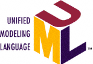

# Fundamentals of Model Translation

### Abstract  
Models capture the requirements of a system in a form that is more
abstract than textual documents.  A model is a valuable and semantically
precise means of expressing functional requirements, system behavior and
constraints.  However, a model is not the implementation.  The model is
not shipped as the final product.  So, development methods must specify
the path from requirements to implementation.  Model Translation
is a method of moving from requirements into implementation in a
clearly defined, repeatable, step-by-step process.

### Document References  
[1] [OMG](http://www.omg.org/) Object Management Group  
[2] [Raistrick et al](https://www.amazon.com/Model-Driven-Architecture-Executable-UML/dp/0521537711) Model Driven Architecture with Executable UML:  Raistrick, Francis, Wright, Carter, Wilke  
[3] [Mellor et al](https://www.amazon.com/MDA-Distilled-Stephen-J-MELLOR/dp/0201788918) MDA Distilled, Principles of Model-Driven Architecture:  Mellor, Scott, Uhl, Weise  
[4] [Kemp, Smith](https://commons.wikimedia.org/w/index.php?curid=10633070) Adapted from Paul Smith's work at wikipedia, CC BY 3.0  
[5] [UML and SysML](http://www.omg.org/gettingstarted/what_is_uml.htm) OMG UML  

## Mapping in the Development Process  
_Mapping_ is at the core of _Model Translation_.  Model Translation is a
refinement to the traditional design process that steps from Requirements
to Design to Implementation to Test.
Model Translation is based on the Object Management Group (OMG) [1]
standard for Model-Driven Architecture (MDA) [3].
Mapping focuses on the
move from the Requirements and Design phases to the Implementation phase.
Requirements and Design phases are modified slighltly by making them more precise.
Strictly speaking, Mapping is a technique used in
Implementation that _translates_ requirements and design artifacts into
target technology in a predictable, repeatable and step-by-step process.
Elements from Requirements and Design are _mapped_ into an Implementation
following a set of rules defined in the Design.

The following sections explain the refinements to each step of a
traditional, iterative waterfall process.  Requirements Specification,
Design and Implementation are discussed one at a time.  A section with
example Model Translations using Mapping conclude the paper.

 Iterative Waterfall Model [4]  

## Requirements Specification  
Projects begin with requirements specification.  This process serves
to clearly state the required functionality of the system.
The specification is crucial to capture and communicate the essentials
of the system.  Requirements Specification stimulates
discussion, debate and reasoning over the system requirements.
So, even the process of creating the high-level requirements specification
is a key exercise in the development of a successful, working system.

In a modeling paradigm, the requirements specification is
equally important.  However, a level of precision is introduced into
the high-level requirements specification.

#### High-Level Requirements Specification Document  
A project must take care to interpret the phrase _high-level_ carefully.
High-level must mean 'abstract' and focused on the salient aspects of
the system specification.  An abstract specification spotlights the
important functional requirements of the system and intentionally omits
information that is not relevant (to requirements).

High-level does not mean 'imprecise', 'loose' or 'vague' [2 p28].
If the high-level requirements specication is not precise, then it is
not specific.  And a 'specific'ation must, by definition, be 'specific'!

#### Models  
Model-Driven Architecture prescribes modeling to the requirements
specification to supply the precision needed to map Requirements
into Implementation.  A Platform Independent Model (PIM) which captures
functional requirements is built as part of the specification process.
Since the Requirements Specification focuses on functional requirements
alone, the PIM is kept free of technology choices which are specified
during Design.

In its simplest form a Design model can be a list of required
functional and behavioral elements in the system.  At a richer
level, a model can be formalized in an industry standardized
modeling language such as UML and SysML [5].
The most precise models are executable and can be shown to fulfill
requirements by walk-through testing or even with automation.

  

## Design  
Requirements specification focused on functional requirements; Design
focuses on the technologies being used to satisfy the requirements.
Design specifies _non-functional_ requirements.  _Non-functional_
may seem to be an odd term; it means specifications that define the
technology of the system rather than its required behavior.
Examples of design elements include hardware technologies,
microprocessors, network protocols, operating systems, and programming
languages.

Design supplies an architecture upon which the specified requirements
can be fulfilled.

As in Requirement Specification, Design also produces a list of elements.
This list of elements represents the system architecture.
This list is different from the list produced
by Requirements Specification, but it is related.  Later in this paper
we will explore the relationship between elements in Requirements and
elements in Design.  We will map them together into the Implementation.
Design is complete when each element listed in the Requirements
Specification has an architectural element in the Design that can be
used to implement it.

#### Models  
Again, MDA prescribes modeling.  A list of elements can be sufficient
for simple systems.  But for complex systems, a more precise definition
of the Design can be communicated in a model.
A Platform Specific Model (PSM) is crafted that illustrates the
elements in the system/software architecture.  Since Design focuses
on the platform and technologies, the model is made specific to the
platform.  This Design model is independent of functional requirements
but is very specific to the target architecture chosen technologies.
The model adheres to
semantics that clearly define and constrain each element in the Design.
Each element of the system/software architecture is illustrated in a
model of the software architecture.

With a model of Requirements and a model of Design, a model-to-model (M2M)
transformation can be done that maps these model elements together
into the Implementation.
As a final step of the Design process a set of rules is defined.
One rule is defined for each type of element in the Requirements.
Each rule explains how to pair an element in the Requirements with
an element in the Design.
This set of mapping rules is the core of the Model Translation.
These rules can be applied manually.

With models, much of this mapping and translation can be automated.

## Implementation  
Implementation realizes the Requirements within the constraints of the
Design.

In some systems, the process of Implementation is not clearly specified.
In such cases the implementation team must satisfy the input Requirements
and Design in an _ad hoc_ fashion.  A successful Implementation is proven
by Testing.  But the Implementation team is not given a process whereby
the Requirements and Design _translate_ into the Implementation.  Such
a set of rules make Implementation easier, faster and more precise.

Model Translation provides a more precise, repeatable and step-by-step
approach to implementation.  The process of Implementation is accomplished
by _Mapping_.  Elements from the Requirements Specification are paired
with elements from the Design and realized in the Implementation.
The rules to govern this mapping are written as part of the Design.

## Example  
Following is a simple example of Model Translation using Mapping.
The example is a GPS Tracker used to track the location of a person
or boat sailing on the sea.
The example shows Requirements, Design and a Mapping to Implementation.

### GPS Tracker  

#### GPS Tracker:  Requirements  
Consider a GPS Tracker that acquires and accumulates track points
on a periodic time basis to record the path of the person or ship
carrying the GPS Tracker.  During the Requirements Specification
phase the engineering team establishes that the GPS Tracker will
communicate with satellites to obtain location information in the
form of latitude and longitude measurements.  Altitude will be
omitted, because this GPS Tracker is for maritime use and will
always be at sea level.  Each GPS track point will have a time
stamp.  Track points are to be kept in the sequence in which they
were collected.  The GPS Tracker will collect GPS track points
only when it is moving and not when it is stopped (stationary).
Instantaneous speed is calculated using any two adjacent track points.

Following is a list of elements identified during the requirements
specification of the GPS Tracker:
  - satellite
  - latitude measurement
  - longitude measurement
  - time stamp
  - GPS track point
  - another new GPS track point
  - moving
  - stopped
  - speed

#### GPS Tracker:  Design  
The Design of the GPS Tracker targets an ARM7 running a multi-threading
uiTRON RTOS with C as the target language.  Data is stored using C `struct`s
in linked lists.  Data is statically allocated; no dynamic memory allocation
is allowed.  Support for floating point, integer, string and
boolean types is supplied.  State behavior is stored in tabular
format with a small dispatcher to sequence the steps of program
execution.

The following list of Design elements is derived from the Design
described above.
  - ARM7
  - uiTRON
  - C
  - data type
  - integer value
  - floating point value
  - thread
  - data allocation
  - `struct` with members 
  - function

#### Mapping (Translation Rules)  
Next, we establish a set of rules that guide a mapping of elements
from the list of elements identified in the Requirements onto the
list identified in Design.

(Simplified) Translation Rules:  
  a. Map each multi-field data element onto a C `struct`.
  b. Map each atomic data element onto a field in one of the
     structures above.
  c. Map atomic real values onto `float` or `double` as precision requires.
  d. Map atomic integer values onto `int`.
  e. Map systems states (such as 'moving' and 'stopped') onto a state
     enumeration with enumerators named the same as the states.

Even with the simple lists above together with a few translation rules,
the Implementation team has some level of guidance on taking Requirements
and translating them into a form that runs on the target.
The representation of a satellite in the system/software architecture
will be a C `struct`.  Time stamps, latitude and longitude measurements
will become members within the structure of a track point each having
their properly mapped type.  The states of the system (moving and
stopped)  will be stored in a state variable with values based on
an enumeration.

Requirement Spec Element    | Design Spec Element  
--------------------------- | -------------------  
satellite                   | `struct`  
latitude measurement        | floating point value
longitude measurement       | floating point value
time stamp                  | integer value
GPS track point             | `struct` with members
another new GPS track point | data allocation
moving                      | state enumerator
stopped                     | state enumerator
speed                       | integer value

 GPS Track Point  
Above is a UML model of a GPS Track Point.  This model graphically
depicts the same information provided in the lists but communicates
it with more precision.

## Conclusion  
_Model Translation_ is a technique that uses elements identified
during Requirements Specification and Design to produce an
Implementation.  The process involves _mapping_ these elements in
step-by-step approach following a set of translation rules.  This
process can be done manually or automated with tools.
Automation is best leveraged when a modeling language is used to
capture the high-level requirements specification.
Whether performed manually in a list-based approach or automatically
with model translation tools, the result is a more precise and repeatable
process of implementation.
